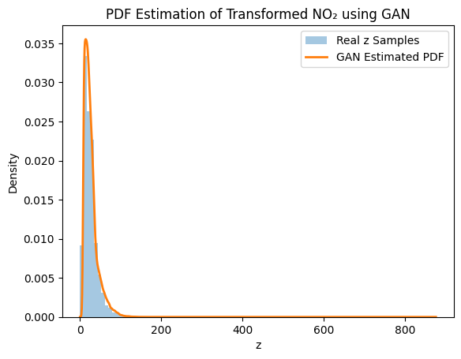

Learning an Unknown Probability Density Function Using GAN

📌 Project Overview
This repository presents an implementation of a Generative Adversarial Network (GAN) to learn the unknown probability density function (PDF) of a non-linearly transformed random variable.
The transformed variable is derived from NO₂ concentration values taken from real-world air quality data.

The key objective of this project is to model a probability distribution implicitly, without assuming any analytical or parametric form (such as Gaussian or exponential distributions).

🎯 Objective

To learn an unknown probability density function of a transformed random variable using a Generative Adversarial Network (GAN).

The GAN is trained only on samples of the transformed variable and the learned distribution is later visualized using Kernel Density Estimation (KDE).

Value of a_r:0.5
Value of b_r:0.3

📊 Dataset Description

Dataset: India Air Quality Dataset

Feature Used: NO₂ concentration

Source: Kaggle

Variable Definition:

𝑥
: NO₂ concentration

𝑧
: Transformed random variable

Only valid, non-missing NO₂ values are used in this project.

🏗️ GAN Architecture
Generator Network

class Generator(nn.Module):

    def __init__(self):
        super(Generator, self).__init__()
        self.net = nn.Sequential(

            nn.Linear(1, 128),
            nn.ReLU(),

            nn.Linear(128, 128),
            nn.ReLU(),

            nn.Linear(128, 64),
            nn.ReLU(),

            nn.Linear(64, 1)
        )

    def forward(self, noise):
        z_fake = self.net(noise)
        return z_fake

Discriminator Network

The discriminator distinguishes between real samples 
​

class Discriminator(nn.Module):

    def __init__(self):
        super(Discriminator, self).__init__()
        self.net = nn.Sequential(

            nn.Linear(1, 128),
            nn.LeakyReLU(0.2),

            nn.Linear(128, 128),
            nn.LeakyReLU(0.2),

            nn.Linear(128, 64),
            nn.LeakyReLU(0.2),

            nn.Linear(64, 1),
            nn.Sigmoid()
        )

    def forward(self, z):
        validity = self.net(z)
        return validity

⚙️ Training Configuration
| Parameter     | Value                |
| ------------- | -------------------- |
| Epochs        | 15,000               |
| Batch Size    | 64                   |
| Optimizer     | Adam                 |
| Loss Function | Binary Cross-Entropy |
| Noise Input   | ( N(0,1) ) |

📝 Observations

🔹 Mode Coverage

The GAN successfully captures multiple modes introduced by the sinusoidal transformation. The generated samples overlap well with the real data distribution, indicating effective mode coverage with minimal mode collapse.

🔹 Training Stability

Training remains stable across 15,000 epochs. The balance between the generator and discriminator prevents either network from dominating, although minor oscillations are observed, which are typical in GAN training.

🔹 Quality of Generated Distribution

The generated distribution closely resembles the real transformed NO₂ distribution. The GAN effectively learns a complex, non-linear PDF without relying on any parametric assumptions.

📈 Visualizations
Histogram of Transformed NO₂ Variable (z)

This plot shows the empirical distribution of the transformed variable 
𝑧
z obtained after applying the non-linear sinusoidal transformation to the NO₂ concentration values.

PDF Estimation of Transformed NO₂ using GAN

This plot compares the probability density function learned by the GAN (estimated using KDE from generated samples) with the histogram of the real transformed samples.

